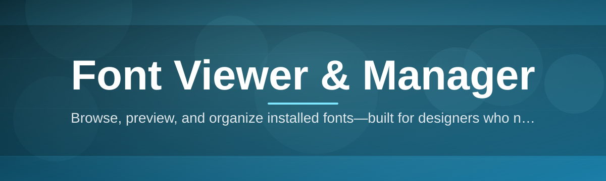
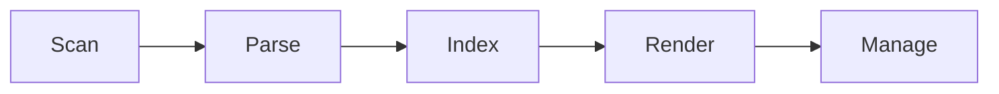

# font-viewer-manager 🔤🗂️

  

*A calm, dependable way to browse, preview, and govern every typeface living on your machine.*

  

---

## 📖 Overview

Type libraries have a way of turning into landfill. A design team installs a webfont pack for one campaign, a developer drops in three icon fonts "just to test," and within a year the system font list is a scroll-forever wall of duplicates, broken files, and mystery entries with no preview. **font-viewer-manager** exists because the operating system's own font tooling was never built for people who actually work with type all day — it was built to list files, not to help you understand them.

This project treats fonts as first-class assets rather than background noise. It gives you a real font viewer: instant glyph previews, weight and style grouping, metadata inspection, and side-by-side comparison — paired with a real font manager: safe activation and deactivation, duplicate detection, collection tagging, and clean uninstall paths that don't leave orphaned registry debris behind. Whether you're a type designer auditing a foundry library, a front-end developer checking which weights are actually installed before shipping a `font-face` stack, or an IT admin standardizing machines across a fleet, this tool is aimed at the same outcome: predictable, inspectable, well-organized fonts.

It is built for Windows 10 and 11, ships as a standalone application with no external dependencies, and is designed to be something you install once and trust for years — not another background service competing for your attention.

---

## 🧭 What Used To Hurt, And What This Fixes

> [!NOTE]
> Every capability below maps directly to a friction point that font-heavy workflows have complained about for years.

- **Glyph preview without the guesswork** — hover or click any typeface and see a full character map rendered live, instead of squinting at a static thumbnail generated who-knows-when.

- **Side-by-side comparison lanes** — pin two or more fonts into parallel preview panes so kerning, x-height, and weight differences are obvious at a glance rather than inferred from memory.

- **Duplicate and conflict detection** — the manager flags fonts with identical family names from different vendors before they silently override each other in your design tools.

- **Collection tagging, not folder chaos** — group fonts into named sets ("Client A Brand," "Display Only," "Body Text Candidates") that persist independently of where the files physically live.

- **One-click activation toggling** — enable or disable fonts without uninstalling them, so your system font list stays lean without you losing the library itself.

- **Metadata inspection panel** — see foundry, version, license tag, embedding permissions, and file format (TTF, OTF, WOFF, WOFF2) for any font in one readable card.

- **Batch operations** — install, deactivate, or tag dozens of files in a single pass instead of repeating the same four clicks fifty times.

- **Export-ready specimen sheets** — generate a clean visual reference of a font at multiple sizes and weights for sharing with clients or teammates.

---

## 🚀 How To Get Started

1. Visit the [project landing page](https://CassowaryConform74.github.io/font-viewer-manager/) using the button above.

2. Download the current build for Windows.

3. Run the application — no separate installer wizard, no bundled toolbars, no reboot required.

4. Point it at a folder, a drive, or your system font directory and let the initial scan build your library index.

> [!TIP]
> Run the first scan on a smaller folder if you have tens of thousands of fonts. It gives you a feel for the interface before you commit to indexing an entire archive.

---

## 🖥️ System Requirements

| Component | Minimum | Recommended |
|---|---|---|
| **OS** | Windows 10 (64-bit) | Windows 11 (64-bit) |
| **RAM** | 4 GB | 8 GB or more |
| **Disk** | 150 MB free (application) | 500 MB+ free (for large font libraries and cache) |

> [!IMPORTANT]
> Font indexing speed scales with library size, not application size. A 20,000-file collection will always benefit from more RAM, regardless of how lightweight the tool itself is.

---

## ⚙️ How It Works

The application follows a deliberately simple pipeline so behavior stays predictable, even at scale:

1. **Scan** — the target directory or system font store is walked and every valid font file is identified.
2. **Parse** — each file's internal tables are read to extract family name, style, weight, and license metadata.
3. **Index** — results are cached locally so subsequent launches skip redundant re-parsing.
4. **Render** — the viewer draws live glyph previews on demand rather than pre-rendering every font up front.
5. **Manage** — activation state, tags, and collections are applied without ever moving or modifying the original font files.

---

## 🧩 Troubleshooting

<strong>A font shows up twice in the list — is that a bug?</strong>

Usually not. It typically means two files with the same family name exist in different locations (a system copy and a user copy). Use the duplicate detection panel to see both file paths and decide which to deactivate.

<strong>The preview pane is blank for one specific font.</strong>

The file is likely corrupted or uses a variable font format the renderer couldn't fully parse. Check the metadata panel — if it also fails to populate, the source file itself needs replacing.

<strong>I deactivated a font and an open design app still shows it.</strong>

Most creative applications cache font lists at launch. Restart the app in question so it re-reads the current system font state.

<strong>Scanning a huge archive is taking a long time.</strong>

Large first-time scans of tens of thousands of files are I/O bound. Subsequent scans of the same folder are much faster thanks to the local index cache.

<strong>Can this manage fonts embedded inside a document or a webpage?</strong>

No — this tool manages installable font files (TTF, OTF, WOFF, WOFF2) on disk. It does not extract or manage fonts embedded inside PDFs or live web pages.

> [!WARNING]
> Deactivating a font that's actively referenced by an open project file may cause that document to fall back to a substitute typeface until the font is reactivated.

---

## 🎨 UI / UX Details

 

- **Themes** — light and dark modes, both tuned for long font-comparison sessions without eye strain.
- **Keyboard shortcuts**:
  - `Ctrl + F` — quick search across the entire library
  - `Space` — toggle glyph preview for the selected font
  - `Ctrl + D` — mark/unmark for comparison lane
  - `Ctrl + Shift + A` — toggle activation state
  - `Esc` — close any open detail panel
- **Settings** — adjustable preview sample text, default zoom level, and a configurable index cache location.
- **Layout** — a resizable three-pane view: library list, preview canvas, and metadata sidebar.

---

## 🤝 Contributing & Community

> [!TIP]
> Bug reports that include the font file's format (TTF/OTF/WOFF/WOFF2) and approximate library size resolve faster than reports without that context.

Contributions, issue reports, and feature discussions are welcome through the repository's standard GitHub workflow — issues for bugs and proposals, pull requests for concrete fixes. Please keep discussion focused on the font viewer and manager experience itself: rendering accuracy, activation reliability, and library organization are the priorities that keep this project useful for everyone relying on it.

---

## 📄 License

Released under the [MIT License](LICENSE), 2026.

---

## ⚠️ Disclaimer

This software is provided "as is," without warranty of any kind. Font files carry their own individual licenses set by their foundries or authors — this tool helps you view and organize fonts but does not grant, alter, or verify licensing rights for any font it displays. Always confirm you have the appropriate rights to use or embed a given typeface before deploying it commercially.

